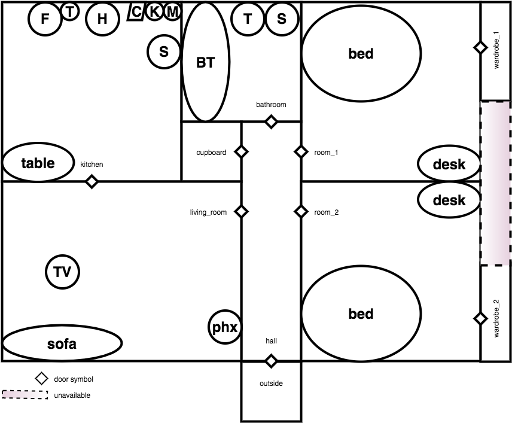

# Example input files #
Example input files for the smart house generator contain *flat with two bedrooms* layout (`rooms.l`, `layout.l` and `activities.l`) given in *Figure 1* and sample paths compatible with this house:

* `path_normal.l` - a normal working patterns (9 to 5);
* `path_part.l` - a part time job with morning hours on Monday and Tuesday, and afternoon hours on Wednesday, Thursday and Friday;
* `path_shift.l` - a shift job with day shifts on Monday and Tuesday, and night shifts on Thursday, Friday, Saturday (free days are Wednesday and Sunday).

Weekend for both *normal* and *part time* jobs look the same. On Saturday the person watches TV, uses computer, goes shopping and leaves home for party in the evening. The whole Sunday is spent at home with watching TV and using computer as the main activities.  
During weekdays the part time worker fills the day with TV watching and using computer in contrast to the full time worker.

Shift worker sleeps through the day on Wednesday to get ready for the night shift; the rest of the time is filled with watching TV and using computer. Sunday is similar to Wednesday but the person additionally goes shopping.  
Day shift days look exactly the same as any working day for full time (normal) worker. Night shift days are rearranged version of the day shift days.

Each path script contains *week* worth of data. For details please consult given path file.

# Available datasets (`Prolog` and `Aleph`) #
Three different data packages are prepared based on the above path scripts. They contain raw smart house data, fact (`Prolog`) representation of the data, facts about the house (room layout, sensor placement, etc.), ground truth for location and 4 target labels generated based on the ground truth:

* `not_location` - not being in the given room **for** the next 30 minutes (from the current time point);
* `not_location lr` - same as above but only for the `living_room`;
* `return_location` - appearing in the given room **within** the next 30 minutes (from the current time point);
* `return_location lr` - same as above but only for the `living_room`.

Additionally the data is represented in an `Aleph` readable format.

All the datasets are available as a GitHub Release [here](https://github.com/So-Cool/SHgen/releases).
